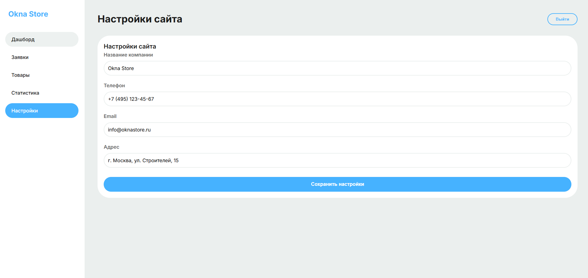

# Okna Store 

Modern website for a plastic windows online store.

Educational project focused on clean markup, responsiveness and an interactive cost calculator.

## ✨ Key Features

- Fully responsive design (mobile-first)
- Interactive **window cost calculator** (type, size, glass unit, options)
- Product catalog and services
- Validated order forms + modals
- Admin panel (in progress)

## 🚀 Tech Stack

**Frontend:**  
HTML5 • CSS3 (Flexbox, Grid, CSS Variables) • Vanilla JavaScript (ES6+)

**Backend (planned):**  
FastAPI + SQLAlchemy • PostgreSQL / SQLite

## 🛠 Installation & Running

```bash
git clone https://github.com/kihaas/okna_store.git
cd okna_store
python -m http.server 8000
```




