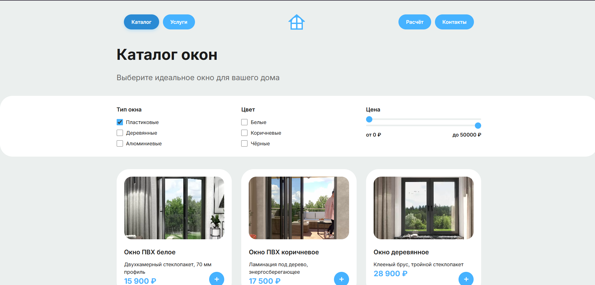
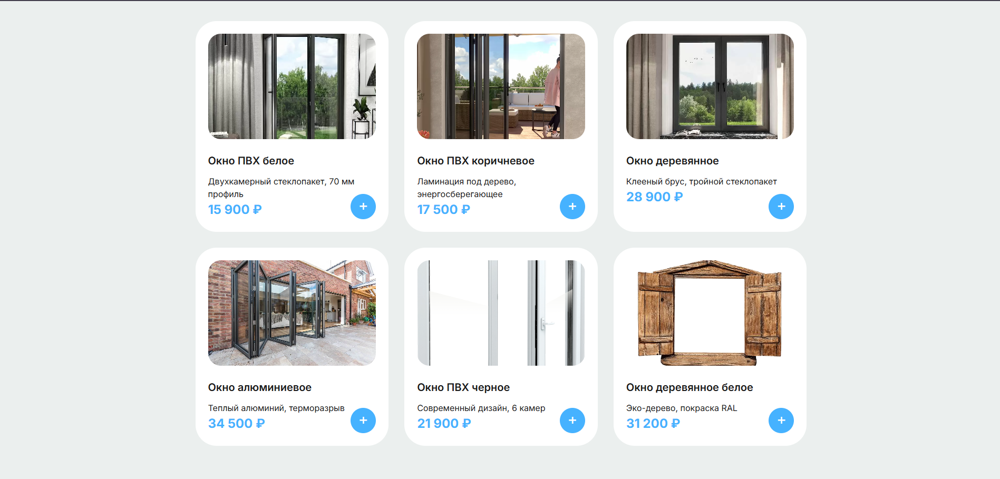
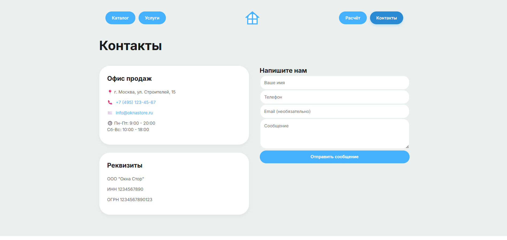
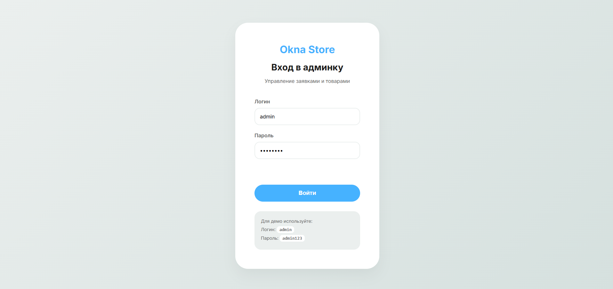
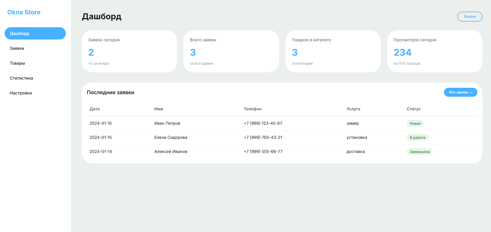
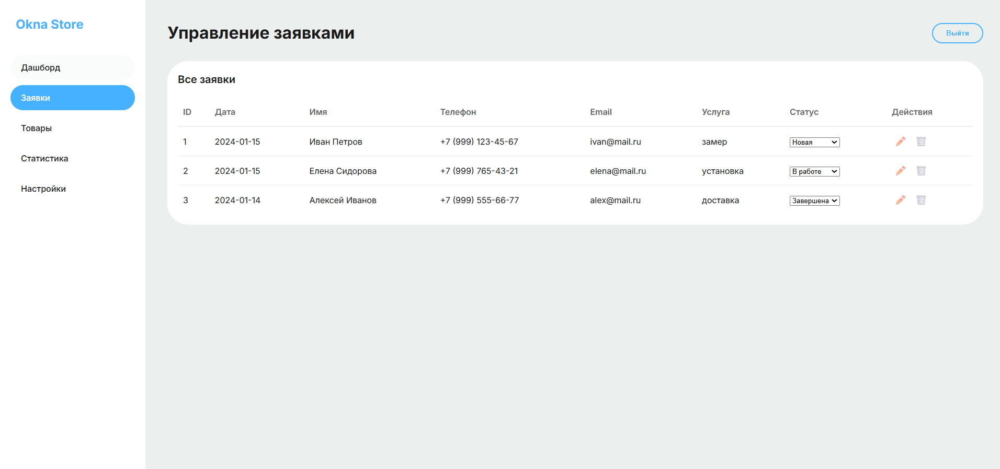
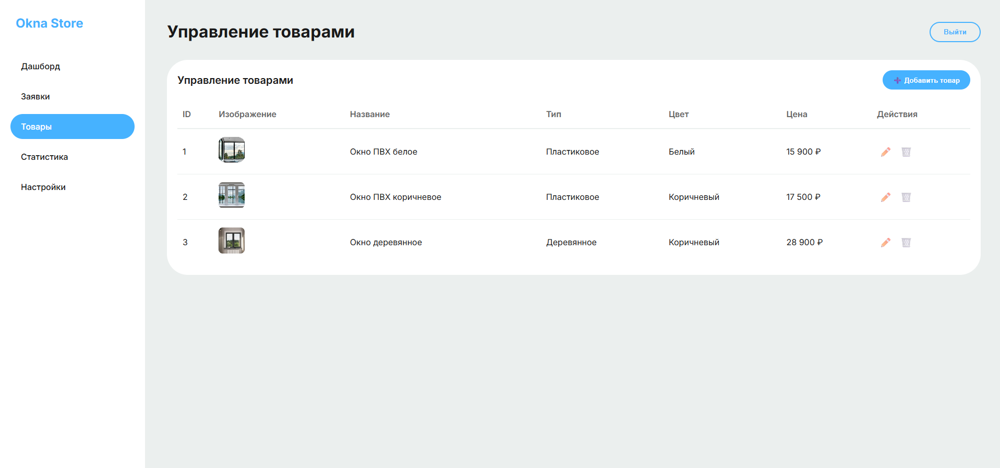
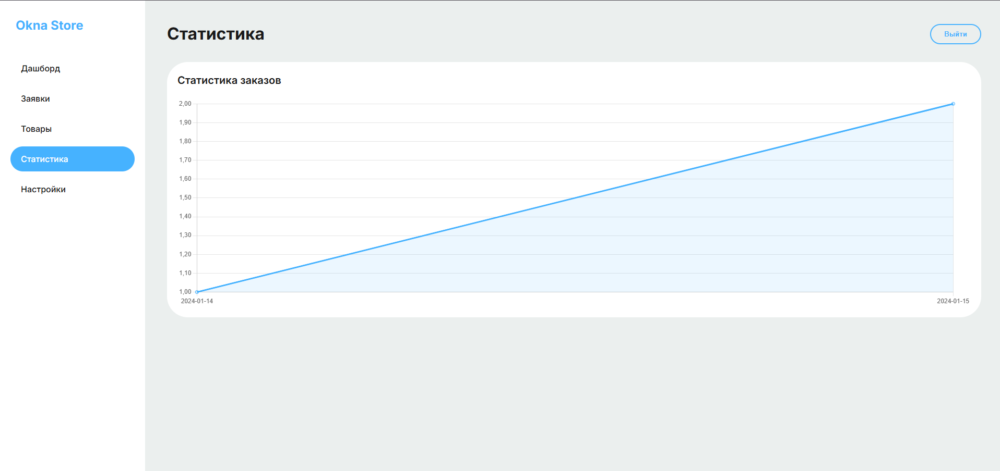

# Okna Store

Современный сайт интернет-магазина пластиковых окон.

Учебный проект с акцентом на качественную вёрстку, адаптивность и интерактивный калькулятор стоимости.

## ✨ Основные возможности

- Адаптивная вёрстка (мобильные + десктоп)
- Интерактивный **калькулятор окон** (тип, размеры, стеклопакет, опции)
- Каталог продукции и услуг
- Формы заявок с валидацией
- Административная панель (в разработке)

## 🚀 Технологии

**Frontend:**  
HTML5 • CSS3 (Flexbox, Grid, CSS Variables) • JavaScript (ES6+)

**Backend (в планах):**  
FastAPI + SQLAlchemy • PostgreSQL / SQLite

## 🛠 Установка и запуск

```bash
git clone https://github.com/kihaas/okna_store.git
cd okna_store
python -m http.server 8000
```













